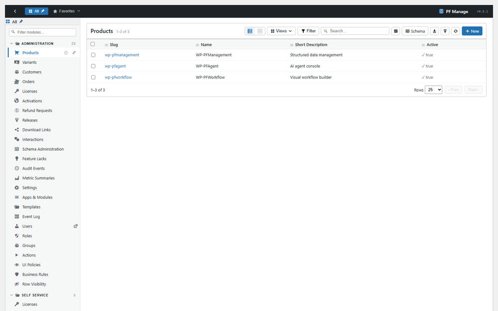
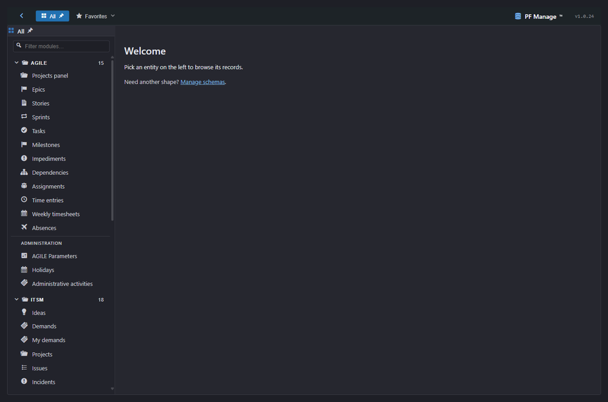
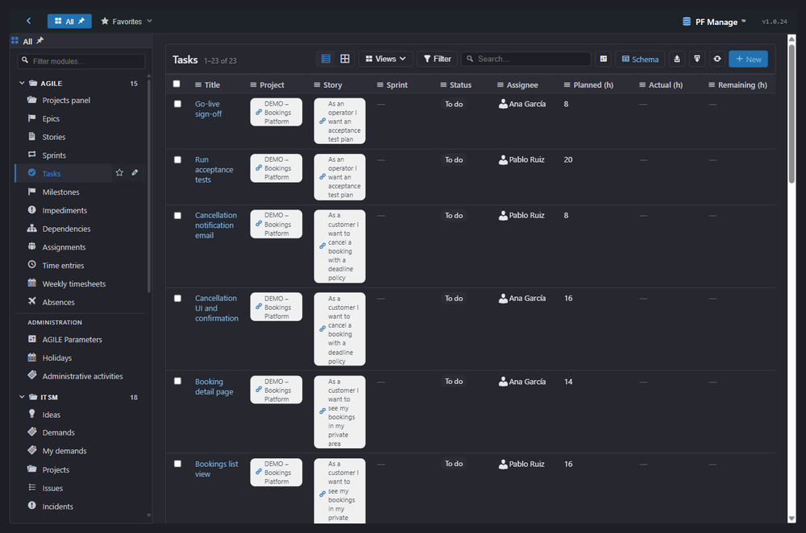
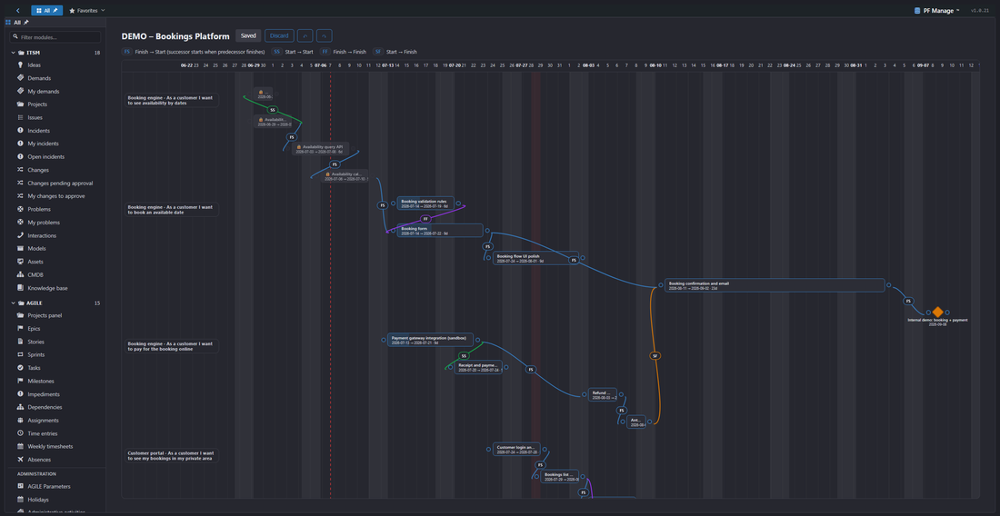
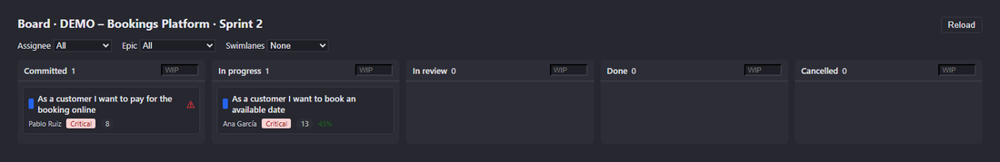
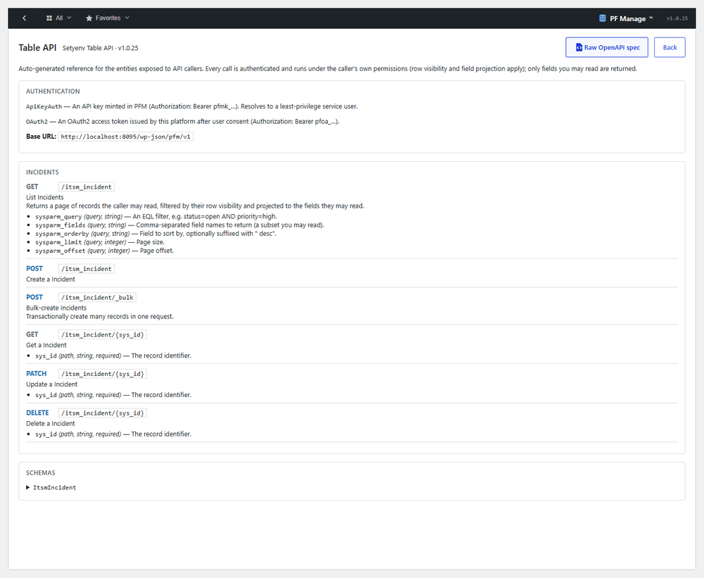
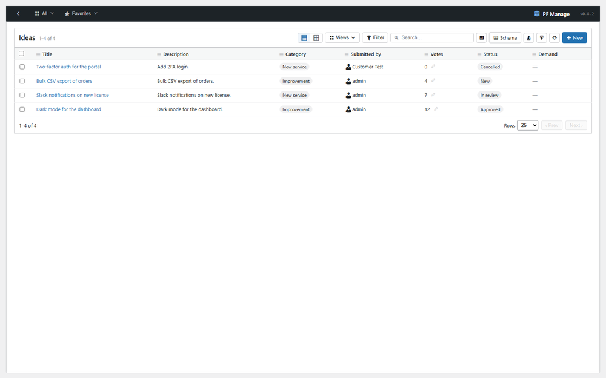

  

<h1 align="center">WP-PFManagement™</h1>

<strong>The low-code platform for WordPress.</strong>

Your own ServiceNow, native to WordPress — part of the <a href="https://setyenv.com">Setyenv™</a> platform.

  <a href="https://setyenv.com"><b>Website</b></a> ·
  <a href="https://setyenv.com/docs/"><b>Documentation</b></a> ·
  <a href="https://setyenv.com/demo/"><b>Live demo</b></a> ·
  <a href="https://setyenv.com/use-case/"><b>Use case</b></a> ·
  <a href="https://setyenv.com/news"><b>News</b></a>

---

**Model your processes, assets and services — and ship real applications — without writing a line of code.** WP-PFManagement is a ServiceNow-style low-code platform, native to WordPress: define entities, fields, forms, lists, permissions and business rules, and build working apps like ITSM, CRM, asset/CMDB or a service desk inside your own WordPress install, with no external SaaS and your data never leaving your database.

It is one of the four pieces of the [Setyenv™](https://setyenv.com) suite. Its event catalog is consumed natively by the WP-PFWorkflow™ engine, and the WP-PFAgent™ AI agent can design an entity, generate its form and wire its automations from a one-line description — so data, automation and AI work together.

> This repository is a **public landing page** for the product. It contains no plugin code — WP-PFManagement is a proprietary, per-domain-licensed plugin, available at **[setyenv.com](https://setyenv.com)**.

  

## What it does

### Structured data, no code

- **Entities, fields & forms.** Model any record type — assets, tickets, contacts, contracts — with a per-entity form layout you design in the UI.
- **Lists & views.** Filterable, sortable lists per entity, organised into a sidebar of **apps and modules**.
- **Row- and field-level permissions.** Control exactly which records each audience can see (row visibility) and which fields they can read or write — enforced server-side on every read path.
- **Business rules.** Declarative rules that react to record changes — validate, transform, or trigger effects — at the data layer.
- **Dialogs.** Guided, multilingual actions on any record: a message plus a set of choices that drive the next step.

  
  

### Agile project management, first-class

A **Kanban board** and an **Agile Gantt** where **each task's width is its duration**, with **typed dependencies, milestones and cascade**. Every card and every bar is a **live record** your workflows can act on — move a card and the record updates.

  

  

### An integration layer, defined in Management

Expose your entities to machine callers and connect to anything, without leaving WordPress:

- **Table API** — a governed REST surface over your entities, with scopes and API keys.
- **REST Message & Scripted REST** — call outbound services, or publish your own endpoints.
- **OAuth client & provider** — authenticate outbound integrations, or let WP-PFManagement be the identity provider.
- **Tokens & scopes** — issue and govern access with `client_credentials` tokens.

  

### Ship real applications

Because the primitives are generic, you assemble complete apps inside WordPress instead of buying another SaaS: **ITSM**, **CRM**, **asset / CMDB**, **service desk**, and more.

  

## The Setyenv™ platform

  <picture>
    <source media="(prefers-color-scheme: dark)" srcset="assets/logo-setyenv-dark.png" />
    
  </picture>

> **Your own ServiceNow, Zapier, and ChatGPT plugins. Inside WordPress. No SaaS in the middle.**

- **WP-PFManagement™** *(this product)* — the low-code platform.
- **[WP-PFWorkflow™](https://github.com/setyenv/wp-pfworkflow)** — the visual workflow engine that consumes WP-PFManagement's events.
- **[WP-PFAgent™](https://github.com/setyenv/wp-pfagent)** — the open-source AI agent that builds entities and workflows from a sentence.
- **[wp-executor](https://github.com/setyenv/wp-executor)** — the open-source Rust runner for host-side work.

You **define** data and processes here, **automate** them in WP-PFWorkflow, reach your **own machine** through wp-executor, and drive all of it in **plain language** with WP-PFAgent. See a worked example at [setyenv.com/use-case](https://setyenv.com/use-case).

## Get it

WP-PFManagement is a **proprietary, per-domain-licensed WordPress plugin**. The standard build ships obfuscated and is **refundable** — so the purchase is the trial; an optional annual add-on delivers the clean PHP source. Evaluate, buy and license it at **[setyenv.com](https://setyenv.com)**.

---

Setyenv™, WP-PFWorkflow™, WP-PFManagement™ and WP-PFAgent™ are trademarks of Setyenv™.
